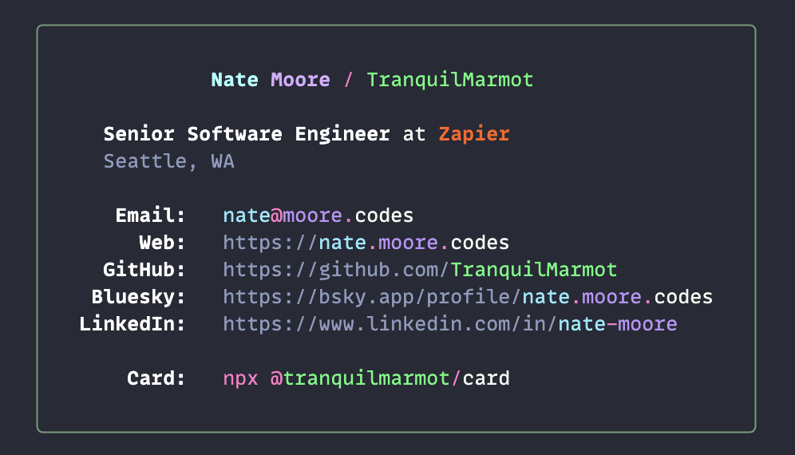

# card

<p align="center">
    
</p>

## Running

Via `npx`:

```sh
npx @tranquilmarmot/card
```

Or locally:

```sh
npm install && npm run show
```

## Building

```sh
npm run build
```

## Publishing

Publishing can be done with:

```sh
npm publish --access public
```

---

Inspired by [bitandbang's card](https://github.com/bnb/bitandbang)
